# 5. Database Entity Model (ERD)

Conventions applied to **every** table unless noted:
- `id UUID PRIMARY KEY DEFAULT gen_random_uuid()`
- `company_id UUID NOT NULL REFERENCES companies(id)` — omitted only on truly
  platform-global tables (`platform_users`, `companies` itself)
- `created_at TIMESTAMPTZ NOT NULL DEFAULT now()`
- `updated_at TIMESTAMPTZ NOT NULL DEFAULT now()` (maintained by trigger)
- `created_by UUID REFERENCES platform_users(id)` where the actor matters
- Soft-delete via `status`/`is_active` rather than hard deletes for anything with
  downstream financial or audit relevance (employees, salary structures, payroll
  records are **never** hard-deleted)

Full column-level DDL is written during each phase, not all up front (per the
"minimum correct schema per phase" principle). This document fixes the **shape and
relationships** so later phases don't need to redesign foreign keys.

## 5.1 Core Relationship Diagram

```mermaid
erDiagram
    COMPANIES ||--o{ BRANCHES : has
    COMPANIES ||--o{ DEPARTMENTS : has
    COMPANIES ||--o{ DESIGNATIONS : has
    COMPANIES ||--o{ EMPLOYEES : employs
    COMPANIES ||--o{ SALARY_STRUCTURES : defines
    COMPANIES ||--o{ LEAVE_TYPES : defines
    COMPANIES ||--o{ PAYROLL_RUNS : runs

    BRANCHES ||--o{ EMPLOYEES : "assigned to"
    DEPARTMENTS ||--o{ EMPLOYEES : "assigned to"
    DESIGNATIONS ||--o{ EMPLOYEES : "assigned to"

    EMPLOYEES ||--|| EMPLOYEE_PROFILES : extends
    EMPLOYEES ||--o{ EMPLOYEE_DOCUMENTS : has
    EMPLOYEES ||--o{ EMPLOYEE_BANK_ACCOUNTS : has
    EMPLOYEES ||--o| EMPLOYEE_TAX_PROFILES : has
    EMPLOYEES ||--o| EMPLOYEE_STATUTORY_PROFILES : has
    EMPLOYEES ||--o{ EMPLOYMENT_HISTORY : has
    EMPLOYEES }o--o| EMPLOYEES : "reports to (manager_id)"

    SALARY_STRUCTURES ||--o{ SALARY_STRUCTURE_COMPONENTS : composed_of
    SALARY_COMPONENTS ||--o{ SALARY_STRUCTURE_COMPONENTS : used_in
    EMPLOYEES ||--o{ EMPLOYEE_SALARY_ASSIGNMENTS : has
    SALARY_STRUCTURES ||--o{ EMPLOYEE_SALARY_ASSIGNMENTS : assigned_via

    EMPLOYEES ||--o{ ATTENDANCE_RECORDS : logs
    SHIFTS ||--o{ SHIFT_ASSIGNMENTS : used_in
    EMPLOYEES ||--o{ SHIFT_ASSIGNMENTS : assigned

    LEAVE_TYPES ||--o{ LEAVE_POLICIES : configured_by
    EMPLOYEES ||--o{ LEAVE_BALANCES : has
    EMPLOYEES ||--o{ LEAVE_REQUESTS : submits

    EMPLOYEES ||--o{ REIMBURSEMENTS : submits
    EMPLOYEES ||--o{ LOANS : holds
    LOANS ||--o{ LOAN_REPAYMENTS : repaid_by

    PAYROLL_RUNS ||--o{ PAYROLL_ITEMS : contains
    EMPLOYEES ||--o{ PAYROLL_ITEMS : "paid via"
    PAYROLL_ITEMS ||--o{ PAYROLL_EARNINGS : breaks_down
    PAYROLL_ITEMS ||--o{ PAYROLL_DEDUCTIONS : breaks_down
    PAYROLL_ITEMS ||--o{ PAYROLL_CONTRIBUTIONS : breaks_down
    PAYROLL_ITEMS ||--o{ PAYROLL_ADJUSTMENTS : corrected_by
    PAYROLL_ITEMS ||--o| PAYSLIPS : generates
    PAYROLL_RUNS ||--o{ PAYROLL_CALCULATION_LOGS : audited_by

    EMPLOYEES ||--o{ APPROVAL_REQUESTS : "subject of"
    PLATFORM_USERS ||--o{ APPROVAL_REQUESTS : "acted on by"
    PLATFORM_USERS ||--o{ AUDIT_LOGS : performs
```

## 5.2 Table Inventory by Module (with key columns)

### Identity / Platform
- **platform_users** — `id (=auth.users.id)`, `email`, `full_name`, `is_platform_super_admin bool`, `status`
- **user_company_roles** — `user_id`, `company_id`, `role` (enum), `employee_id` (nullable link, since not every role holder is an employee — e.g. a pure Finance contractor could be, but typically is)
- **companies** — `id`, `name`, `legal_name`, `country_code`, `subdomain/slug`, `status`, `plan` (future)
- **company_settings** — `company_id` (1:1), `fiscal_year_start_month`, `default_currency`, `timezone`, payroll-cycle config (`payroll_cycle_type`, `pay_day`), feature flags

### Company Structure
- **branches** — `company_id`, `name`, `address`, `gstin/statutory_ids` (jsonb), `status`
- **departments** — `company_id`, `branch_id (nullable)`, `name`, `parent_department_id (nullable, for hierarchy)`
- **designations** — `company_id`, `title`, `level (int, optional)`
- **locations** — `company_id`, `name`, `geo (lat/lng, for geofencing)`, `radius_meters`
- **holidays** — `company_id`, `name`, `date`, `branch_id (nullable = applies to all)`, `is_optional`
- **attendance_policies / leave_policies / payroll_policies** — `company_id`, `name`, `config (jsonb)`, `effective_from`, `effective_to` — policy *content* is jsonb so new rule types don't require migrations; policy *existence/versioning* is relational for auditability

### Employee
- **employees** — `company_id`, `employee_code`, `auth_user_id (nullable until self-service invited)`, `branch_id`, `department_id`, `designation_id`, `manager_id (self-FK)`, `date_of_joining`, `date_of_exit (nullable)`, `employment_type` (full-time/contract/intern), `status` (active/on-leave/exited/terminated)
- **employee_profiles** — `employee_id` (1:1), `first_name`, `last_name`, `dob`, `gender`, `personal_email`, `phone`, `address (jsonb)`, `photo_url`
- **employee_contacts** — `employee_id`, `type` (emergency/next-of-kin), `name`, `relation`, `phone`
- **employee_bank_accounts** — `employee_id`, `account_number (encrypted at rest)`, `ifsc`, `bank_name`, `is_primary`
- **employee_tax_profiles** — `employee_id`, `pan (India)`, `tax_regime`, country-pluggable `jsonb extra`
- **employee_statutory_profiles** — `employee_id`, `pf_number`, `uan`, `esi_number`, country-pluggable `jsonb extra`
- **employee_documents** — `employee_id`, `document_type`, `storage_path`, `verified_at`, `uploaded_by`
- **employment_history** — `employee_id`, `event_type` (promotion/transfer/designation_change/exit), `effective_date`, `previous_value (jsonb)`, `new_value (jsonb)`

### Attendance
- **shifts** — `company_id`, `name`, `start_time`, `end_time`, `grace_minutes`
- **shift_assignments** — `employee_id`, `shift_id`, `effective_from`, `effective_to`
- **attendance_devices** — `company_id`, `device_type` (mobile-gps/biometric/web), `identifier`
- **attendance_records** — `employee_id`, `work_date`, `check_in_at`, `check_out_at`, `check_in_source`, `check_in_location (geo, nullable)`, `status` (present/absent/half-day/on-leave/holiday/weekend), `late_minutes`, `overtime_minutes`, `is_manual_entry`
- **attendance_corrections** — `attendance_record_id (nullable if new entry)`, `employee_id`, `requested_check_in`, `requested_check_out`, `reason`, `status` (via `approval_requests`)

### Leave
- **leave_types** — `company_id`, `name`, `code`, `accrual_type` (fixed/monthly-accrual), `is_paid`
- **leave_policies** — `company_id`, `leave_type_id`, `annual_quota`, `carry_forward_max`, `encashable bool`, `effective_from`
- **leave_balances** — `employee_id`, `leave_type_id`, `year`, `opening_balance`, `accrued`, `used`, `carried_forward`, `closing_balance` (materialized, recalculated by service not by trigger magic)
- **leave_requests** — `employee_id`, `leave_type_id`, `start_date`, `end_date`, `days (numeric, supports half-day)`, `reason`, `status`, links to `approval_requests`

### Salary
- **salary_components** — `company_id`, `name`, `code`, `type` (earning/deduction/employer_contribution), `calculation_type` (fixed/percentage_of/formula), `is_taxable`, `is_statutory` (flag used by payroll engine to route to rule engine vs. plain component)
- **salary_structures** — `company_id`, `name`, `status` (draft/active/archived)
- **salary_structure_components** — `salary_structure_id`, `salary_component_id`, `value_type` (amount/percentage), `value`, `percentage_of_component_id (nullable, e.g. HRA = 40% of Basic)`, `sequence`
- **employee_salary_assignments** — `employee_id`, `salary_structure_id`, `annual_ctc`, `effective_from`, `effective_to (nullable)`, `revision_reason`

### Reimbursements / Loans
- **reimbursements** — `employee_id`, `total_amount`, `status`, submitted via `approval_requests`
- **reimbursement_items** — `reimbursement_id`, `category`, `amount`, `receipt_document_id`, `expense_date`
- **loans** — `employee_id`, `principal_amount`, `interest_rate`, `tenure_months`, `disbursed_at`, `status`
- **loan_repayments** — `loan_id`, `installment_number`, `due_date`, `amount`, `payroll_item_id (nullable, set once deducted)`, `status`
- **advances** — `employee_id`, `amount`, `recovery_plan (jsonb)`, `status`

### Payroll (see [08](./08-payroll-domain.md) for the engine itself)
- **payroll_rule_sets** — `company_id (nullable = platform default)`, `country_code`, `rule_key` (e.g. `epf`, `esi`, `pt`, `tds`), `version`, `effective_from`, `effective_to`, `config (jsonb)` — the configurable statutory engine
- **payroll_runs** — `company_id`, `period_start`, `period_end`, `run_type` (regular/off-cycle/fnf), `status` (state machine, see [08]), `calculated_at`, `approved_at`, `locked_at`, `paid_at`
- **payroll_items** — `payroll_run_id`, `employee_id`, `salary_structure_snapshot (jsonb)`, `gross_earnings`, `total_deductions`, `net_pay`, `lop_days`, `status`
- **payroll_earnings / payroll_deductions / payroll_contributions** — `payroll_item_id`, `component_code`, `amount`, `computed_from (jsonb — traceability)`
- **payroll_adjustments** — `payroll_item_id`, `type` (arrear/correction/reversal), `amount`, `reason`, `created_by`, links back to the run that introduced it if it's a correction-run
- **payroll_calculation_logs** — `payroll_run_id`, `employee_id`, `rule_key`, `input_snapshot (jsonb)`, `output_snapshot (jsonb)`, `rule_version`, `created_at` — the audit trail answering "why this net salary"
- **payslips** — `payroll_item_id` (1:1), `storage_path`, `generated_at`, `generated_by`

### Tax (India-first, pluggable)
- **tax_declarations** — `employee_id`, `financial_year`, `regime`, `declared_investments (jsonb)`, `status`
- **tax_documents** — `employee_id`, `financial_year`, `document_type` (form16/etc.), `storage_path`

### Cross-cutting
- **approval_requests** — `company_id`, `subject_type` (leave/attendance_correction/reimbursement/loan/payroll_run), `subject_id`, `requested_by`, `current_step`, `status` (pending/approved/rejected/cancelled)
- **approval_steps** — `approval_request_id`, `step_number`, `approver_role` or `approver_user_id`, `decided_by`, `decision`, `decided_at`, `comment`
- **notifications** — `recipient_id`, `type`, `title`, `body`, `link`, `read_at`, `channel` (in_app/email)
- **audit_logs** — `company_id (nullable for platform actions)`, `actor_id`, `action`, `entity_type`, `entity_id`, `metadata (jsonb)`, `ip_address`, `user_agent`, `created_at`

## 5.3 Notes on Sensitive Data
- `employee_bank_accounts.account_number` and PAN/UAN/ESI numbers: stored encrypted
  at the application layer (pgcrypto or client-side envelope encryption before
  insert) in addition to RLS — defense in depth for the fields most likely to be
  targeted. Decrypt only in the service layer, never expose in list/table views.
- No sensitive numbers are ever put in JWT claims or logged in `audit_logs.metadata`.
